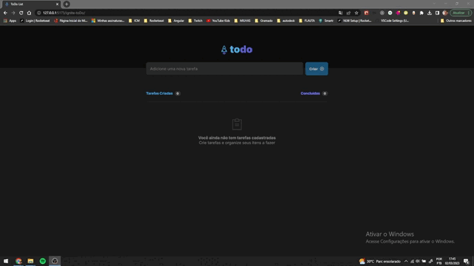

# Desafio do curso Ignite da Rocktseat
Consiste em criar uma lista de tarefas, de acordo com o que o usuário digita no input.



## Funcionalidades:
  * Criar tarefa
  * Listar tarefas
  * Excluir tarefa
  * Concluir tarefa
  * Contador de tarefas concluídas e criadas
  
  ## Figma
  https://www.figma.com/file/KSptw1neh6QxywJcJXVhsz/ToDo-List-(Copy)?t=mVEQpESExcbLbwIN-0
  
  ## Iniciar Projeto
  ```
  npm i
  ```
   ```
  npm run dev
  ```
  
  ## Link Page
  <https://dehrs.github.io/ignite-toDo/>
